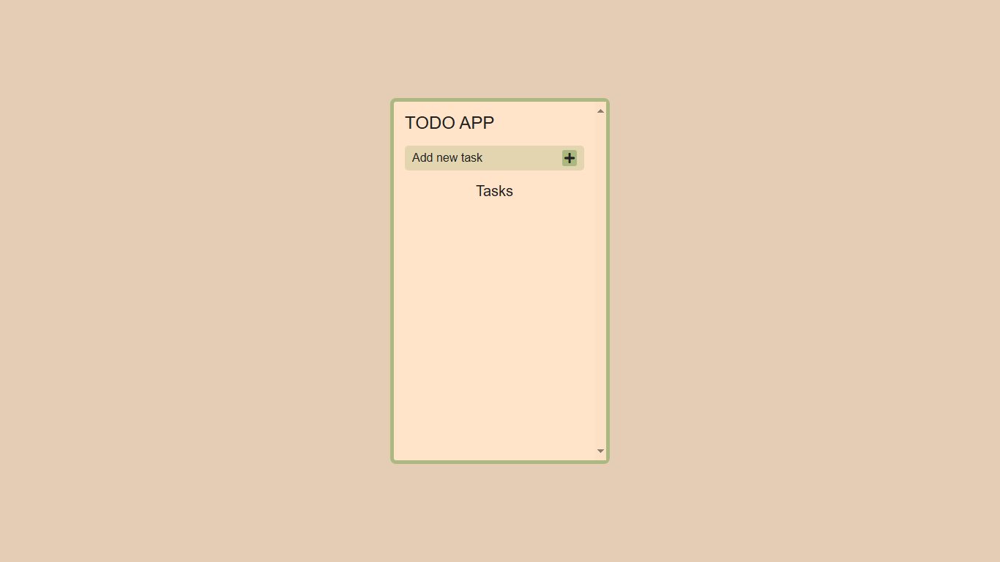
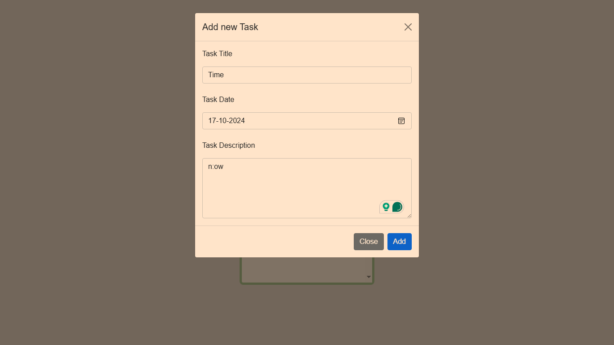
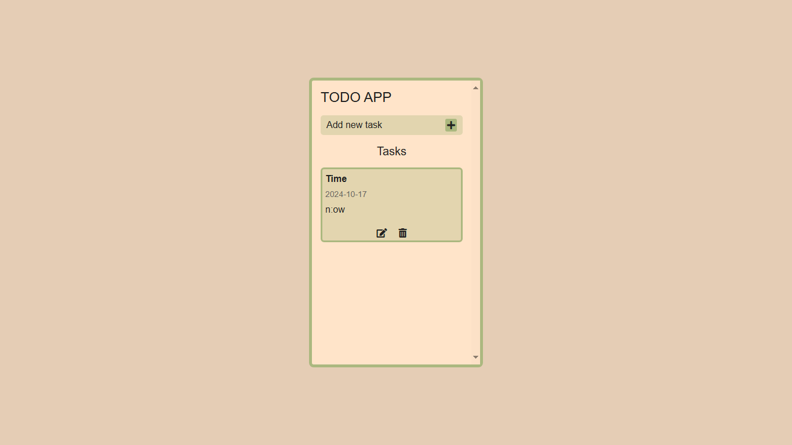

# 📝 To-Do App

This is a simple yet powerful **To-Do List** application that allows users to manage tasks efficiently using **CRUD operations** (Create, Read, Update, Delete). Built with **HTML, CSS, JavaScript, Bootstrap, Font Awesome**, and **Local Storage**, the app ensures tasks persist even after the browser is closed. You can also add **task deadlines/dates** that are displayed along with the task details.

## 🚀 Features

🔯 **Add Tasks**: Click on the **Add** button to open a modal where you can input task details along with a **due date**.  
🔯 **Edit Tasks**: Modify your existing tasks using the edit icon ✏️.  
🔯 **Delete Tasks**: Remove tasks easily with the delete icon 🗑️.  
🔯 **Persistent Storage**: Tasks are saved in the browser's local storage, so they stay even after refreshing the page.  
🔯**Responsive Design**: The app is fully responsive, thanks to **Bootstrap**.  
🔯 **Task Due Dates**: Each task includes the **due date** for better task management.  
🔯 **Error Handling**: If any required fields are empty or inputs are invalid, the app will display error messages to guide the user.

## 🛠️ Technologies Used

⭐ **HTML**: For the structure of the app.  
⭐ **CSS**: To style the UI.  
⭐ **JavaScript**: To handle task operations and local storage.  
⭐ **Bootstrap**: For responsive design and modals.  
⭐ **Font Awesome**: For the edit and delete icons.  
⭐ **Local Storage**: To save and persist tasks.

## 🎨 UI Preview

## 📚 How It Works

1. **Add a Task**: Press the **Add** button, fill in the task details and a **due date** in the modal, and hit Add. Your task will be added to the list with the date displayed.
2. **Edit a Task**: Click the ✏️ icon to update the task. Modify the details and save your changes.
3. **Delete a Task**: Hit the 🗑️ icon to remove the task from the list.
4. **Persistent Data**: All tasks and dates are saved in **local storage**, ensuring that your list stays even after a page reload.
